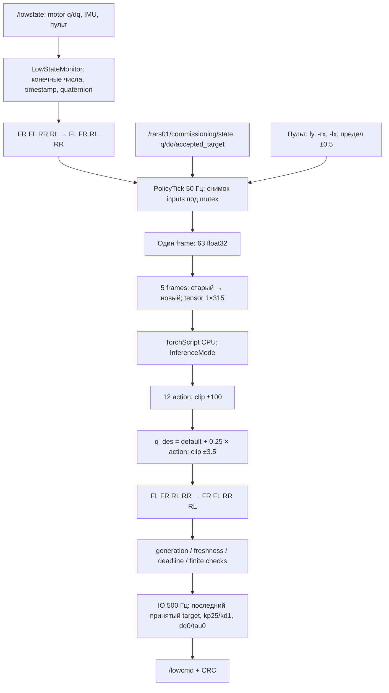

# Аудит X, подъёма, ходьбы и передачи данных в RL

Дата: 07.10.2026. Проверены текущие исходники, operator YAML, read-only Sim2Sim reference и последний физический лог `~/.ros/log/go2_r3_commissioning_28119_1791369128566.log`.

## Главные выводы

1. **Резкое складывание после X объясняется конкретной ошибкой перехода в нашем FSM.** В этом тесте не было плавного lie-down: после X контроллер попал в `policy_result_stale` и отправлял аварийный damping `kp=0, kd=3`. Ошибка воспроизведена offline на текущей библиотеке, без ROS publisher и без робота.
2. **Параметры реально выбранного контроллера: подъём/фиксированное удержание 40/1, RL 25/1.** Они совпадают с YAML референсного Sim2Sim. Небольшие gains сами по себе не гарантируют плавность: важны скачок target, ошибка положения, скорость и момент переключения.
3. **Математика actor и observation совпадает с reference.** `rl_agent.cpp` и `unified_observation_contract.cpp` побайтово одинаковы. Actor-секция production и operator YAML совпадает с reference без отличающихся ключей. Ошибки перестановки FR/FL/RR/RL в текущем входе/выходе RL по коду не обнаружено.
4. **Подъём не полностью под копирку с MuJoCo.** Формула, 6 секунд и gains совпадают, но в reference stand-up использует default pose без перестановки в hardware order. Текущий real-код переставляет её корректно по joint names, поэтому hip-знаки при stand-up отличаются от фактически отправляемых reference. Это расхождение нельзя скрывать словами «полностью одинаково».
5. **Причина дёрганой ходьбы и упора задней частью при подъёме пока не доказана.** Нет записи последовательных command/action/q_des/measured_q/dq/IMU/torque. Есть конкретные возможные механизмы ниже; менять gains или позу наугад по этому наблюдению не следует.

В рамках этого аудита изменена только документация. Runtime-код, gains, позы, watchdogs, веса и запущенные процессы не менялись. Команды LowCmd/Sport/STM32 не отправлялись. Найденная ошибка X пока НЕ исправлена; следующий физический тест с прежним кодом не считается проверкой исправления.

## 1. Что именно случилось после X

Из последнего физического лога:

| Время в логе, секунды | Что произошло |
| --- | --- |
| 1791369291.514336 | X: ACTIVE → CONTROLLED_STOP / ARM_RETURN_HOME; последний принятый policy-result возрастом 19,98 мс |
| 1791369291.514479 | Вызов с compute 4,95 мс отклонён, fault ещё пустой: ticket отменён при X |
| 1791369291.534940 | Через 20,60 мс после X: EMERGENCY_DAMP / `policy_result_stale`; возраст последнего принятого результата 40,62 мс; новый job выполнялся всего 5,31 мс |
| 1791369291.538227 | Новый результат с compute 8,89 мс вернулся уже после fault и отклонён |
| 1791369297.491408 | Вторичное старение Sport observation до 0,502 с → FAULT_LATCHED, выход остановлен |

**В логе нет PD_CAPTURE → LIE_DOWN → LIE_DOWN_VERIFY → PASSIVE.** Значит длительность lie-down 8 секунд в этом эпизоде вообще не применялась. Робот потерял позиционное удержание из-за emergency `kp=0`, а не из-за слишком быстрой штатной интерполяции.

Путь ошибки в коде:

```text
ControlledAbort(X)
  → InvalidatePolicyWork(): отмена ticket выполняющегося ненулевого RL
  → Zero(): команда движения = [0,0,0]
  → ARM_RETURN_HOME: продолжаем требовать RL, пока HOME не подтверждён
  → старый быстрый ответ отвергается по generation (это корректно)
  → следующий policy job стартует на следующем 20-мс callback
  → IO tick 2 мс проверяет возраст последнего принятого результата
  → возраст >40 мс прежде, чем новый быстрый job завершится
  → Fault(policy_result_stale) → EMERGENCY_DAMP 0/3
```

Это **ошибка согласования отмены job и watchdog последнего принятого ответа**, а не 221-мс зависание Torch. В этом логе вычисления 4,95 и 8,89 мс; новый job не превысил свой 40-мс deadline. Снимать общий watchdog или искусственно обновлять timestamp старого action нельзя: так устаревший результат будет выдаваться за новый.

### Offline воспроизведение

Отдельный временный C++ probe использовал текущий `libreal_r3_commissioning.so`, фикстуру здоровых inputs и синтетические часы:

```text
6.000: последний принятый action
6.019: начало очередного job
6.020: X отменяет этот ticket
6.024: результат 5 мс корректно отвергается
6.040: начало нового zero-command job
6.042: IO: policy_result_stale → packet kp=0, kd=3
6.049: результат нового job 9 мс отвергается, потому что fault уже latched
```

Результат: REPRODUCED. Лог: `runtime/x_walk_pose_audit_reproduction.log`. Probe только вычислял объект сообщения в памяти; publisher, ROS init, SDK и serial отсутствовали.

Существующий controlled-stop test обновляет policy-result практически на каждом synthetic IO tick, а не моделирует реальный worker 50 Гц с X во время Act. Поэтому прежние 32/32 PASS не закрывали эту гонку. Первые два запуска временного probe не завершились из-за аргументов линковки и выбора старой библиотеки через LD_LIBRARY_PATH; итоговая проверка явно загрузила candidate build_fsm и воспроизвела ошибку.

### Что нужно изменить следующим шагом

Ввести явную ограниченную фазу X→zero-RL handoff: отменённый ненулевой ответ не принимать; отдельно учитывать переходный deadline и настоящий возраст данных; успеть принять свежий zero-command результат без ложного emergency. Точное поведение выхода на время handoff должно быть определено явно (последний принятый target либо measured hold), а не менять timestamp старого результата. Сохранить защиту от реально зависшего job, stale inputs и B. Добавить тест именно при 50 Гц policy / 500 Гц IO, X посреди job и ответах 5–10 мс; отдельно stalled worker должен остаться аварийным. После этого проверить полный X/HOME/PD/lie/PASSIVE/OFF путь. В этом аудите исправление не вносилось.

## 2. Откуда и как данные попадают в RL



### Источники и единицы

- Ноги: реальные `motor_state[0..11].q` в радианах и `.dq` в рад/с, переставляются по таблице ниже. Данные не подменяются default pose.
- IMU: SDK quaternion `[w,x,y,z]` → actor `[x,y,z,w]`, далее нормализация и inverse rotation вектора `[0,0,-1]`. Gyroscope `[x,y,z]` подаётся без перестановки осей, scale 0,25. В reference тот же порядок. Динамическая калибровка NAV не участвует в этой цепочке.
- Рука: первые шесть валидных моторных ID 1..6, реальные `measured_q`, `measured_dq` и `accepted_target` из единственного arm owner. Рука не управляется выходом этого actor; gripper ID7 исключён из actor. HOME target равен шести нулям, но measured_q/dq остаются измеренными, а не принудительно нулевыми.
- Команда REMOTE: `vx = ly×0.5`, `vy = -rx×0.5`, `wz = -lx×0.5`, clamp стиков [-1,1], deadband 0,01. До actor физическая команда в м/с, м/с, рад/с; внутри observation умножение на `[2,2,0.25]`. Например `[0.5,0.5,0.5]` превращается в `[1,1,0.125]`.
- Neutral / RL_ZERO: нулевая **команда скорости**. Policy продолжает выдавать ненулевые actions для удержания и баланса. Это не нулевые motor targets.
- NAV: отдельный источник, пределы ±0,2 / ±0,1 / ±0,1; REMOTE профиль его не слушает.

### Точная раскладка одного frame: 63 числа

Индексы с нуля; интервалы полуоткрытые, как Python slices.

| Slice | Количество | Формула / порядок |
| --- | ---: | --- |
| `[0:3]` | 3 | gyro xyz × 0,25 |
| `[3:6]` | 3 | projected gravity в системе корпуса |
| `[6:9]` | 3 | `[vx,vy,wz]` × `[2,2,0.25]` |
| `[9:21]` | 12 | `(q_policy - default_dof_pos)` × 1 |
| `[21:33]` | 12 | dq_policy × 0,05 |
| `[33:45]` | 12 | previous clipped policy action, **до** action_scale/default/position clip |
| `[45:51]` | 6 | измеренные arm q, joint1..6 |
| `[51:57]` | 6 | измеренные arm dq × 0,05 |
| `[57:63]` | 6 | accepted arm target, joint1..6 |

Затем весь frame clamp ±100. History: `[f(t−4), f(t−3), f(t−2), f(t−1), f(t)]`, shape `[1,315]`. При входе в RL previous_action сбрасывается в нули, history заполняется пятью копиями текущего frame; первый command принудительно zero. При обычном переключении стика RL_ZERO↔RL_ACTIVE history не сбрасывается. Base linear velocity, LiDAR/point cloud/height map и sin/cos в unified input **не входят**.

Снимок ног, IMU, command, руки и target берётся под mutex. Сам Act выполняется вне mutex, поэтому IO и X/B могут сработать параллельно. Источники руки и ног имеют разные timestamps; это latest snapshot, а не синхронизация всех сенсоров к одному аппаратному моменту.

### Суставы: вход и обратная перестановка выхода

| Hardware motor index | Сустав | Policy index | Stand target real, рад |
| ---: | --- | ---: | ---: |
| 0 | FR hip | 3 | −0,1 |
| 1 | FR thigh | 4 | 0,8 |
| 2 | FR calf | 5 | −1,5 |
| 3 | FL hip | 0 | +0,1 |
| 4 | FL thigh | 1 | 0,8 |
| 5 | FL calf | 2 | −1,5 |
| 6 | RR hip | 9 | −0,1 |
| 7 | RR thigh | 10 | 0,8 |
| 8 | RR calf | 11 | −1,5 |
| 9 | RL hip | 6 | +0,1 |
| 10 | RL thigh | 7 | 0,8 |
| 11 | RL calf | 8 | −1,5 |

Формулы: `q_policy[motor_to_policy[i]]=motor_q[i]`; `motor_q_des[i]=policy_q_des[motor_to_policy[i]]`. Mapping `[3,4,5,0,1,2,9,10,11,6,7,8]` совпадает с reference. Здесь не добавлены sign-flips, offsets или градусы. SDK calibration руки — отдельная цепочка arm owner.

### Выход actor и LowCmd

```text
raw = module.forward(history)           # 12 чисел в actor order
previous_action = clip(raw, -100, 100)
q_policy_des = clip(default + 0.25 × previous_action, -3.5, 3.5)
q_motor_des[i] = q_policy_des[mapping[i]]
```

`PolicyResult` принимает только текущий ticket/generation, 12 finite targets ±3,5, job/observation age ≤40 мс, отдельно свежую руку/target и готовность системы. Три подряд compute ≥20 мс вызывают fault. IO повторяет принятый target каждые 2 мс; **новый action вычисляется каждые 20 мс**, между actions нет интерполяции. `MakeLowCmd` отправляет mode1, q_des, dq_des=0, tau_feedforward=0, kp/kd выбранного режима, затем CRC.

Важно: YAML `torque_limits` не превращается в software clamp момента в этом физическом пути. `Agent::ComputeTorque` здесь не вызывается: мотор получает q/kp/kd, а не рассчитанный нами torque. В активном reference ROS bridge (`simulate/src/main.cc`, MujocoRosLowLevelBridge::Apply) PD-момент пересчитывается перед каждым physics step 500 Гц и явно ограничивается ±23,7 / ±35,55 Н·м. SDK2 bridge тоже содержит PD-формулу, но config_go2_rars01.yaml отключает его (`enable_unitree_bridge: 0`) и включает ROS bridge. Поэтому утверждение, что используемый Sim2Sim держит устаревший PD-момент между policy frames, было бы неверным. Нельзя утверждать, что на реальном моторе именно YAML torque_limits ограничивает PD-момент; фактические hardware limits этим аудитом не установлены.

## 3. Gains, плавность и дёрганая ходьба

| Этап | kp | kd | Target / время |
| --- | ---: | ---: | --- |
| Measured capture | 40 | 1 | текущий measured q |
| Stand | 40 | 1 | линейная интерполяция measured→stand, 6 с |
| Hold после stand | 40 | 1 | stand pose, 4 с |
| RL | 25 | 1 | новый policy target 50 Гц, без smoothing |
| X до HOME | 25 | 1 | policy с нулевой velocity command |
| X measured PD / lie-down | 40 | 1 | measured capture → lie target за 8 с |
| B / аварийный damping | 0 | 3 | позиционное притяжение отсутствует |
| Успешный PASSIVE | 0 | 0 | mode0 / stop sentinels, 10 пакетов → output OFF |

Стартовый лог конкретного теста печатает именно fixed40/1 и rl25/1. Выбор этих массивов и запись kp/kd в packet подтверждены исходниками; агент не снимал дополнительный физический /lowcmd recording во время этого аудита.

Даже kp25 даёт изменение PD-момента примерно 5 Н·м при скачке target на 0,2 рад, без учёта damping. Поэтому «gains не высокие» не исключает рывок.

Подтверждённые свойства, способные влиять на ощущения:

- Нет acceleration/slew limiting velocity command: стик может изменить команду за один frame. Deadband 0,01 мал; в логе есть частые RL_ZERO↔RL_ACTIVE. Это смена command, не перезапуск actor/history. Без записи сырых стиков нельзя определить, была ли это ручная работа или шум.
- Нет smoothing q_des между policy frames. Ступенчатое удержание target есть и в reference; добавление фильтра изменит closed-loop actor и не должно маскировать неверный input.
- Stand40/1 → первый принятый RL25/1 происходит без blending gains/target. Нулевой command не означает первый action=0. Измеренный robot stand уже отличался от target перед RL.
- Общий position clip ±3,5 рад не соответствует отдельным joint ranges модели (например calf reference −2,7227..−0,83776). Это не доказательство, что policy выходила за диапазон: её actual actions в логе не записаны.
- Gains и agent совпадают с Sim2Sim, но массы, контакт, батарея, моторная динамика, calibration и задержки реального робота не определяются этим совпадением.

Для ходьбы точной причины пока нет. Последний лог содержит переходы и compute samples, но не q_des/action/dq/torque; по нему нельзя честно выбрать между резкой командой стика, action скачками, плохим tracking, физической динамикой или несовпадением training state.

## 4. Подъём и упор задней частью

В физическом логе:

```text
STAND_TRANSITION 1791369147.109372
HOLDING          1791369153.111251   # 6,002 с
RL_ZERO          1791369157.149554   # ещё 4,038 с
```

Формула real и reference: `q_des=q_start*(1-u)+q_stand*u`, `u=clamp(elapsed/6,0,1)`. Ускорение в начале/конце отдельно не сглаживается: это линейная траектория, не S-curve. На реальном IO она обновляется по elapsed каждый 2-мс tick, в reference — по 300 policy ticks 50 Гц.

В конце подъёма worst stand error = **0,3529 рад (~20,2°), motor5=FL calf**. После 4 с удержания перед RL error = **0,2820 рад (~16,2°), тот же motor5**. Подъём завершается по времени, не по подтверждению достигнутой позы/наклона корпуса. В RL поле stand_error сравнивает измеренные q с **фиксированной stand pose**, а не с текущим policy target: его изменения при ходьбе нельзя считать RL tracking error.

### Найденное расхождение с фактическим reference stand-up

Reference `mujoco_sim.cpp`, MODE_STANDUP, берёт `default_dof_pos[i]` без `net2joint_indexes[i]`. Его bridge однозначно описывает hardware slots как FR,FL,RR,RL. Поэтому фактические hip targets reference при stand-up:

```text
hardware FR,FL,RR,RL: [+0.1, -0.1, +0.1, -0.1]
текущий real:        [-0.1, +0.1, -0.1, +0.1]
```

Thigh0,8 и calf−1,5 одинаковы для всех ног, перестановка их не меняет. Reference RL action output уже использует net2joint mapping и возвращается к actor order. Текущий real stand по joint names соответствует actor default pose и именованной позе в доступном go2_walk config; **слепо копировать reference hip-знаки в actor observation нельзя**. Если требуется точно повторить manual reference stand, stand target следует отдельно явно определить, сохранив actor default/mapping. Физическая пригодность такого изменения не доказана; здесь оно не сделано.

Нынешний lie target hardware:

```text
FR: [+0.01, 1.30, -2.70]
FL: [-0.01, 1.30, -2.70]
RR: [-0.30, 1.30, -2.70]
RL: [+0.30, 1.30, -2.70]
```

Глубокое сгибание calf и разные front/rear hip начальной позы означают, что одинаковая доля линейной интерполяции суставов не гарантирует одинаковую высоту/нагрузку стоп или горизонтальный корпус. Упор задней частью требует сопоставить именно pitch/roll, q_des и measured q задних ног во время подъёма. Текущий лог не содержит этих временных рядов; ни ошибку задних индексов, ни конкретный новый stand target по нему установить нельзя.

## 5. Provenance модели и границы проверки

`weights/policy_2.pt` SHA256: `a70b18b88e6ee2fe32de4904559404f4f672dff2396e95ca2c851fdefc5a8cdc`. Совпадает с текущим deployment manifest и хешем, указанным в reference `STAGE4D_VIRTUAL_PAYLOAD_WELD_MVP_REPORT.md`. Сам `policy_2.pt` в проверенном read-only snapshot отсутствует; побайтовое сравнение с ним выполнить нельзя.

Manifest содержит training commit=null, checkpoint=null, status=unverified_provenance. Совпадение 315→12 и scale ещё не доказывает происхождение checkpoint и его точные training gains. Доступный общий go2_walk config имеет kp20/kd1, но не подтверждён как config этого 63-D actor; **по нему нельзя автоматически менять deployment25/1**. Это отдельный незакрытый вопрос экспорта, не доказанная причина текущего поведения.

## 6. Что делать по результатам

1. Сначала исправить и проверить обнаруженную гонку X. Не менять watchdog/gains ради обхода этого fault. До исправления прежний X может снова перевести здоровый быстрый worker в emergency вместо lie-down.
2. Для подъёма явно решить расхождение manual reference hip-signs против именованной actor pose; отдельно измерить tracking и наклон на траектории. Нельзя объявить подъём корректным только потому, что прошло 6 секунд.
3. Для ходьбы добавить ограниченную диагностику, не меняющую control path: сырые стики, выбранный command, input63/history generation, raw/clipped action12, q_des12, measured q/dq12, IMU quaternion/gyro, имеющийся tau_est, фактические publish интервалы и переходы. Записывать и сопоставлять по steady timestamps, не печатать весь tensor синхронно в IO500Гц.
4. По этим данным выбирать исправление: command slew при резких стиках; input/mapping/calibration при несоответствии наблюдений; физический tracking при корректном target и плохом исполнении. Gains/filter/stand pose менять отдельно и с объяснением результата.

## 7. Файлы для проверки и последующего исправления

Пути относительно `sim2real/repos/workhop_rl`:

- `src/unitree_ros2_to_real/src/r3_commissioning.cpp`: ControlledAbort, InvalidatePolicyWork, BeginPolicy/PolicyResult, Tick; ошибка X и deadline handoff.
- `src/unitree_ros2_to_real/include/r3_commissioning.hpp`: состояние и timestamps переходной фазы, если понадобятся.
- `src/unitree_ros2_to_real/src/go2_r3_commissioning.cpp`: snapshot/PolicyTick/IO, будущая ограниченная диагностика.
- `src/unitree_ros2_to_real/tests/system_controlled_stop_test.cpp`: добавить реалистичную асинхронную cadence, X посреди inference.
- `src/unitree_ros2_to_real/src/real_controller_core.cpp` и `src/unitree_ros2_to_real/src/safety_io.cpp`: проверенная перестановка input/output и packet construction.
- `src/unitree_rl_controller-ros2/src/unified_observation_contract.cpp` и `src/unitree_rl_controller-ros2/src/rl_agent.cpp`: точная цепочка63→315→12, совпадающая с reference; не менять ради маскировки FSM fault.
- `src/unitree_ros2_to_real/config/go2_rars01_real.yaml` и `config/profiles/go2_rars01_commissioning.yaml`: gains/limits/pose; в этом аудите не изменены.
- Reference `repos/workhop_rl/src/unitree_ros2_to_real/src/mujoco_sim.cpp` и `src/unitree_mujoco/simulate/src/unitree_sdk2_bridge/unitree_sdk2_bridge.cc`: read-only подтверждение hip-sign discrepancy, mapping и PD.

Обновлены данный отчёт, ссылки/краткие findings в основном README и общий журнал решений. Ничего не закоммичено, сборка и физический запуск не выполнялись.


## Последующее исправление

Исторические выводы выше относятся к коду до следующего изменения. X handoff исправлен и проверяется в [новом отчёте](CODEX_X_HANDOFF_FIX_AND_RL_JERK_REPORT.md). Там также уточнён активный simulation bridge: ROS500Гц с пересчётом PD и torque clamp; SDK2 bridge отключён.
