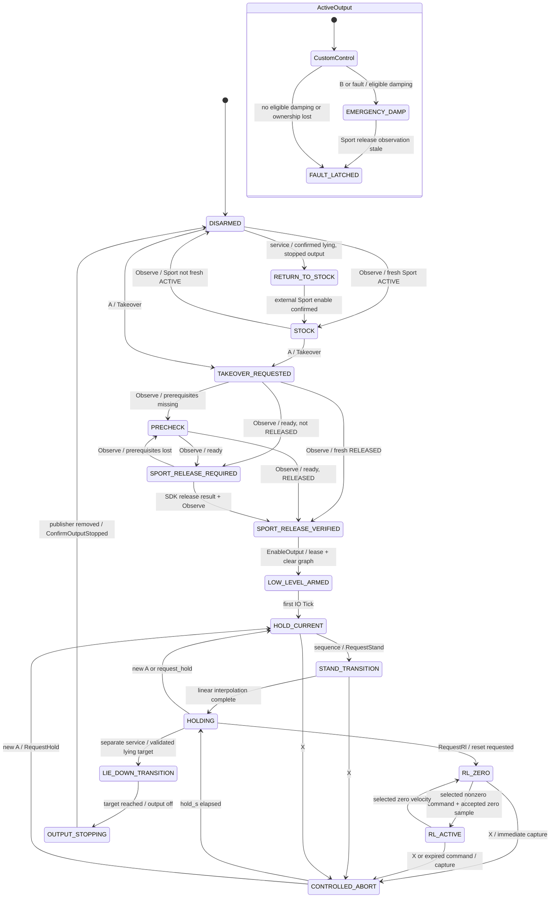
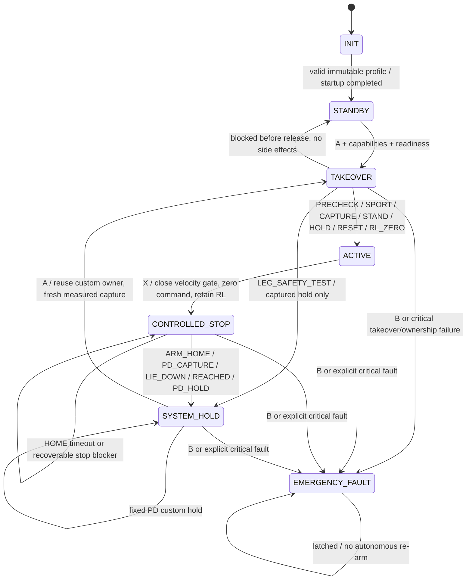

# Central System FSM — аудит и план PHASE A

Дата: 05.10.2026. Репозиторий: `RubSevian/workhop_rl`, ветка `ros2_go2_rars01_real`.
Baseline: `39b78c9f998f8c86368afb91774096e66418fc93`; текущий HEAD совпадает.
Задание: [CODEX_SYSTEM_FSM_REFACTOR (1).md](../../../../CODEX_SYSTEM_FSM_REFACTOR%20%281%29.md).

## 1. Результат и граница выполненной работы

**PHASE A выполнена: прочитаны текущие переходы, ROS callbacks/services, владение ногами, owner руки, launch/config и тесты; подготовлен план. Runtime, конфиги, launch и установленная сборка не изменены. PHASE B не начиналась.**

Оператор сообщил после последнего физического запуска: «всё работает хорошо». Это `OPERATOR_REPORTED` для текущего пути A → подъём → удержание → RL_ZERO, а не измеренный PASS всех физических сценариев. Логи этого успешного запуска, физический lie-down и emergency руки — `NOT VERIFIED` в рамках данного аудита.

Новое задание меняет поведение X и B существенно: сейчас X сразу прекращает RL и держит измеренную позу, B воздействует только на ноги. Целевой X должен сначала сохранять RL с нулевой скоростью, вернуть руку HOME и лишь затем выполнить lie-down. Целевой B должен дополнительно запросить emergency disable руки. Эти изменения нельзя выдавать за уже существующие или физически проверенные.

Ничего не отправлялось по LowCmd/SDK/serial, процессы робота не запускались и не завершались. Новые build, CPU benchmark и физические проверки в PHASE A не запускались. Исследованы исходники и ранее сохранённые результаты; `ctest -N` использован только для списка тестов.

## 2. Где находится управление сейчас

| Компонент | Реальная роль |
|---|---|
| `R3Supervisor` | Единственный владелец `R3State`, но переходы распределены по многим методам, `Observe`, `Tick` и обработке результатов policy |
| `R3Node` | ROS адаптер и исполнитель side effects: publisher, lease, SDK helper, выбор command source; вызывает изменяющие состояние методы из нескольких callbacks |
| `RealControllerCore` | Имеет собственные `Mode`/`SafetyFsm`, но R3 node использует `Load`, `agent`, `SetMeasuredLegs`; его `RequestMode/Tick/SendTargets` в R3 path не вызываются |
| `AutoHomeController` | Локальный lifecycle единственного serial owner; глобальные состояния Go2 не меняет |
| `SdkHomeTransport` | Connect/Enable/Send/Read/Status; сейчас отсутствует метод Disable в этом интерфейсе |
| `LowCmdDiscoveryWait` | Проверка graph после Sport release; не владеет глобальным state |
| Навигация | Передаёт `TwistStamped`; подтверждённого readiness/cancel интерфейса к commissioning node нет |

Не следует переносить R3 locomotion в `RealControllerCore::Mode`: это создаст второй конкурирующий источник управляющих решений. Сам `Agent` и его контракт остаются вычислительным компонентом.

Основные исходники: [enum/API](../../src/unitree_ros2_to_real/include/r3_commissioning.hpp), [переходы/пакеты](../../src/unitree_ros2_to_real/src/r3_commissioning.cpp), [ROS wiring](../../src/unitree_ros2_to_real/src/go2_r3_commissioning.cpp), [owner руки](../../src/unitree_ros2_to_real/src/rars_r3_owner.cpp), [AUTO HOME](../../src/unitree_ros2_to_real/src/rars_auto_home.cpp).

## 3. Текущий граф состояний



`ActiveOutput` выше — поясняющая группа, не дополнительный `R3State`. Fault возможен во всех активных состояниях, в том числе HOLDING/LIE_DOWN. `request_hold`, `request_stand`, `request_rl` являются отдельными guarded services и могут менять последовательность. Все 18 значений enum учтены.

Особенности, которые диаграмма сама по себе не доказывает:

- `abort_sequence_` нигде не устанавливается в true. Ветки CONTROLLED_ABORT → STAND → LIE_DOWN фактически не включаются; обычный X не опускает робот.
- `RequestLieDown` — отдельная ручная операция с `lie_down_validated`; текущие production/trial configs имеют false. После успешной этой операции LowCmd выключается — целевой X должен делать иначе.
- B до появления output отменяет последовательность, но `Emergency` возвращает `no active custom output` без latch. Уже запущенный release helper может закончить отключение Sport. Целевая обработка B в TAKEOVER требует отдельного изменения и теста; текущие tests не доказывают latch в этом случае.
- Прямой B выставляет fault latch, но не присваивает `last_fault` причину operator emergency. Целевой статус должен объяснять причину.
- Проверка отсутствия чужого publisher выполняется перед созданием своего; это не доказательство отсутствия будущего внешнего, не соблюдающего lease publisher.

## 4. Полный реестр мест, меняющих commissioning state

Все записи `state_` сейчас находятся в `src/r3_commissioning.cpp`; дополнительные переходы global state из node происходят через эти методы.

| Метод | Переход / условие | Кто вызывает |
|---|---|---|
| constructor | DISARMED | startup node |
| `Observe` | STOCK↔DISARMED; TAKEOVER/PRECHECK/SPORT_RELEASE_REQUIRED→PRECHECK/SPORT_RELEASE_REQUIRED/VERIFIED; critical fault | `Refresh` из IO, PolicyTick и services |
| `Takeover` | STOCK/DISARMED→TAKEOVER_REQUESTED | A; `StartRemoteSequence` |
| `StartRemoteSequence` | A после X → RequestHold; включает sequence flags | IO `HandleRemote` |
| `RemoteSequenceNext` | Возвращает RELEASE_SPORT/ENABLE_OUTPUT/STAND/RL; fault при precondition loss | node `SequenceTick` |
| `EnableOutput(true/false)` | LOW_LEVEL_ARMED / OUTPUT_STOPPING либо FAULT_LATCHED | `SetOutput`, `StopPublisher`, enable_output service |
| `RequestHold` | HOLD_CURRENT + measured capture | service; A after X |
| `RequestStand` | STAND_TRANSITION + measured capture | service; sequence |
| `RequestRl` | RL_ZERO + invalidate/reset request | service; sequence |
| `RequestLieDown` | LIE_DOWN_TRANSITION | отдельный service |
| `ControlledAbort` | CONTROLLED_ABORT, немедленно без RL | X; controlled_abort service |
| `Emergency` / `Fault` | EMERGENCY_DAMP либо FAULT_LATCHED | B/service; Observe/Tick; node errors; policy errors |
| `ManualCommand` | zero→CONTROLLED_ABORT, nonzero→RL_ACTIVE | IO deadman expiry; старый C++ API/tests |
| `VelocityCommand` | RL_ZERO↔RL_ACTIVE | RemoteTestCommand/NavigationCommand из PolicyTick |
| `Tick` | LOW_LEVEL_ARMED→HOLD_CURRENT; stand→HOLDING; abort→HOLDING; lie-down→OUTPUT_STOPPING; expired velocity→CONTROLLED_ABORT; watchdog→fault | IO timer |
| `ConfirmOutputStopped` | DISARMED без fault | `StopPublisher` |
| `RequestReturnToStock` | RETURN_TO_STOCK | service, только stopped output + validated lying |
| `ConfirmStockObserved` | STOCK | `Refresh`, только external ACTIVE confirmed |
| `BeginPolicy/PolicyResult/PolicyFailed` | Fault при reset/time/action/input failures | policy callback |

Node отдельно вызывает `Fault` при invalid_lowstate, crc_or_packet_validation, transport_exception, sdk_release_failed, remote_sequence_failed. `StopPublisher` выключает supervisor output, уничтожает publisher, освобождает lease только при отсутствии pending release и подтверждает stop. Нельзя оставить эти side effects вне решения центральной FSM при миграции.

Services `/go2/commissioning/{enable_output,request_hold,request_stand,request_rl,request_lie_down,controlled_abort,emergency_damp,request_return_to_stock}` — реальные входы изменения состояния. `manual_step` уже отклоняется. Подписки на старые manual_request/deadman отсутствуют.

## 5. Текущие A/X/B, владение, policy и readiness

### A и Sport/LowCmd

IO timer 2 мс вызывает `HandleRemote` под mutex. `R3RemoteCommands::Poll` уже даёт приоритет B > X > A и потребляет одновременно пришедшие lower-priority edges. Комбинации удерживаются ≥0,75 с, требуют отпускания; remote timeout 0,25 с. Независимого RF timestamp нет: remote извлекается из LowState.

Physical A с `remote_auto_sequence=true` вызывает `StartRemoteSequence`. До release требуются свежие известные Sport/LowState/remote, policy/config, HOME, transport, operator gates и emergency legs config. Уже свежий RELEASED пропускает release. Node получает output lease до RPC; helper работает в отдельном процессе, timeout wrapper 8 с. Подтверждение Sport использует время начала query, то есть не искусственно омолаживает ответ.

После RELEASED graph должен непрерывно оставаться clear 0,5 с; общий discovery timeout 20 с. `SetOutput` повторно проверяет graph/lease и создаёт publisher только после разрешения supervisor. SDK Sport active=0, released=1. Автоматического SDK enable через X нет.

A после X при живом output в HOLDING/CONTROLLED_ABORT повторно захватывает измерения, переиспользует publisher/lease и не отправляет release повторно. Конкурентный pending helper обрабатывается отдельно; новый дизайн обязан проверить его позднее завершение после B/cancel.

### Подъём и RL_ZERO — зафиксированный baseline

1. Первый пакет: captured measured q, fixed Kp=40/Kd=1, dq=0, tau=0.
2. Начальный hold: минимум 0,02 с по orchestration ticks; не жёсткая wall-clock гарантия ровно20 мс.
3. `RequestStand` ещё раз берёт свежий measured q; линейно `q0*(1-u)+stand*u`, u=clamp(elapsed/6,0,1).
4. STAND6 с, HOLD4 с; завершение stand по времени, без проверок достижения0,01 рад.
5. `RequestRl`: нулевая velocity, invalidate старых tickets, reset_pending.
6. PolicyTick загружает текущие leg/arm observations, сбрасывает history/previous action через ResetPolicyState до Act.
7. До первого accepted action сохраняется fixed hold40/1; затем RL gains25/1 на всех12.
8. Actor315=63×5 →12; arm6 joints, gripper исключён; hardware/policy mapping `[3,4,5,0,1,2,9,10,11,6,7,8]`.

Stand hardware target FR/FL/RR/RL: `[-0.1,0.8,-1.5, 0.1,0.8,-1.5, -0.1,0.8,-1.5, 0.1,0.8,-1.5]`. MakeLowCmd записывает gains, dq/tau, mode, head/reserves и CRC; IO проверяет AllowsPacket и публикует этот packet. Ничего в этом пути не требует переписывания для новой orchestration.

### Команды и policy watchdog

`control_mode` выбирается при startup: remote_test или autonomy; `motion_commands_enabled=false` даёт нулевую velocity. Параметры копируются в members и runtime callbacks их не обновляют, но ROS parameter descriptors не помечены immutable. Нет типизированного OperationProfile/capabilities. Guarded request_stand/request_rl позволяют более широкий manual staging, чем будущий LEG_SAFETY_TEST; профили должны ограничивать и services.

Remote: vx=ly, vy=-rx, wz=-lx, deadband0,01, bounds0,20/0,10/0,10. NAV: TwistStamped, QoS depth1, header+receive freshness≤0,25 с, reject malformed/future/zero/stale/NaN; out-of-bound сейчас clamp. Stale NAV даёт velocity zero, policy продолжает работать. `pathFollower::sendSportCommand=false` необходимо сохранять. Факт получения `/cmd_vel` не является navigation_ready.

Policy50 Гц, IO500 Гц, две callback groups, executor2 threads. Act выполняется вне mutex, приём результата/смена режима/publish — под mutex. Нет очереди параллельных jobs. Ответ watchdog40 мс от принятия результата; job deadline40 мс от ticket start; captured LowState40 мс; captured arm feedback/target0,25 с. Burst3 расчётов≥20 мс защёлкивает policy_deadline_burst. Старые/повторные/отменённые tickets не обновляют часы. При fault нет auto recovery. Сохранять эти точные семантики, включая первый ответ.

### Рука и проблемы для FULL_MISSION

Owner сейчас не имеет ROS command subscribers/services. Он connect →10 с→enable один раз в процессе→семь HOME zeros100 Гц. Обратная связь нужна после enable, используется startup grace. Journal диагностический, не блокирует новый процесс; runtime latch сохраняется. `setZero` не вызывается. Systemd unit подготовлен, но установка/активность службы в этом аудите `NOT VERIFIED`.

`static_hold` опубликован как `arm_home_ready`. Node проверяет семь motor IDs/status/valid/q/dq, zero HOME targets, connected/enabled/watchdogs и шесть actor joints. `Blockers` требует `arm_static_hold` и, по config, HOME не только перед A, но и при каждом Observe/Require. Поэтому уход руки из HOME сейчас может вызвать leg fault. Нельзя просто отключить этот bool в YAML: нужна раздельная readiness, контроль свежего accepted q_arm_des и самого owner.

Текущие X/B лишь ставят `arm_hold_request`; node его потребляет без отправки руке. SDK `RarsArm::disable()` существует, но AutoHomeTransport этого метода не предоставляет; наличие SDK функции не подтверждает physical emergency behavior. Per-joint CAN freshness и bench disable/relax — `NOT VERIFIED`.

## 6. Целевая архитектура: один authoritative owner

**Решение: рефакторить существующий R3Supervisor на месте.** Он получает SystemState, TransitionPhase, Dispatch(event, readiness, now) и immutable capabilities. Пока миграция не закончена, имя класса/файлы сохраняются для уменьшения риска. При необходимости `SystemSupervisor` будет alias того же класса, а не второй объект/FSM.

Все записи global SystemState находятся только в Dispatch/reducer. Node callbacks публикуют facts/events, исполняют уже разрешённые actions и возвращают completion/failure с generation. Никаких прямых RequestStand/EnableOutput/StopPublisher без события центральной FSM. Локальные arm lifecycle и leg interpolation phases допустимы, но не выбирают глобальный state. RealControllerCore::Mode не подключается как альтернативный global owner.



Unknown profile — startup exception/process exit до любых SDK/LowCmd/enable side effects. Блокировка после начавшегося release не означает возврат в STANDBY/Stock: Sport может быть уже выключен. Она отображается как explicit fault/blocker; никакого автоматического enable Sport.

При LEG_SAFETY_TEST завершение capture приводит к SYSTEM_HOLD с phase=CAPTURE_HOLD, без stand/RL/lie-down. X из TAKEOVER/leg-safety hold не является X из ACTIVE: предлагается cancel takeover/hold measured без запуска новой lie-down; B всегда выше. Эти контекстные правила необходимо согласовать в PHASE B до physical activation.

### Все старые состояния → новая модель

| Старое значение | Целевой global/phase | Судьба |
|---|---|---|
| STOCK | STANDBY + sport=ACTIVE, owner=STOCK | derived fact |
| DISARMED | STANDBY + owner=NONE/stock observation | derived fact |
| TAKEOVER_REQUESTED | TAKEOVER::PRECHECK | phase |
| PRECHECK | TAKEOVER::PRECHECK | phase/blockers |
| SPORT_RELEASE_REQUIRED | TAKEOVER::SPORT_RELEASE | phase/action |
| SPORT_RELEASE_VERIFIED | TAKEOVER::SPORT_VERIFIED | phase |
| LOW_LEVEL_ARMED | TAKEOVER::LOW_LEVEL_CAPTURE | phase |
| HOLD_CURRENT | TAKEOVER::HOLD_CURRENT; LEG_SAFETY→SYSTEM_HOLD::CAPTURE_HOLD | context phase |
| STAND_TRANSITION | TAKEOVER::STAND | unchanged trajectory |
| HOLDING | TAKEOVER::HOLD либо SYSTEM_HOLD::FIXED_PD | context, не безусловная замена |
| RL_ZERO | ACTIVE + locomotion=RL, command zero | locomotion fact |
| RL_ACTIVE | ACTIVE + locomotion=RL, selected velocity | locomotion fact |
| CONTROLLED_ABORT | CONTROLLED_STOP phases | target X меняется отдельно |
| LIE_DOWN_TRANSITION | CONTROLLED_STOP::LIE_DOWN | новая terminal hold semantics |
| OUTPUT_STOPPING | internal shutdown/transport action; global определяется причиной | не самостоятельный global state |
| RETURN_TO_STOCK | явная maintenance operation вне нормального A/X/B | deprecated service; не auto transition |
| FAULT_LATCHED | EMERGENCY_FAULT + output eligibility | no recovery |
| EMERGENCY_DAMP | EMERGENCY_FAULT + legs=DAMPING | output phase |

R3State может временно остаться вычисляемой deprecated status projection для старых тестов/инструментов; второго mutable `R3State state_` рядом с SystemState не будет. Старые функции станут event wrappers, а не независимыми setters.

## 7. Event/action/readiness contract

События: START_REQUEST, CONTROLLED_STOP_REQUEST, EMERGENCY_REQUEST, READINESS_CHANGED, SDK_RELEASE_DONE/FAILED, OUTPUT_CAPTURED/FAILED, STAND_DONE, HOLD_DONE, POLICY_READY/FAILED, ARM_HOME_CONFIRMED/FAILED, LIE_DOWN_REACHED/TIMEOUT, OUTPUT_STOPPED, SHUTDOWN. Асинхронные ответы несут sequence generation в адаптере; поздний ответ после cancel/B не переводит систему вперёд.

Actions: QUERY/RELEASE_SPORT, ACQUIRE/REUSE_LEG_OWNER, ENABLE_CAPTURE_OUTPUT, START_STAND, RESET_POLICY, RUN_ZERO_POLICY, ACCEPT_SELECTED_VELOCITY, CANCEL_NAV, CANCEL_MANIPULATION, ARM_RETURN_HOME, ARM_EMERGENCY_DISABLE, CAPTURE_PD_HOLD, START_LIE_DOWN, HOLD_LIE_DOWN, LEG_DAMP, STOP_OUTPUT_IF_INELIGIBLE. Executor не выбирает переходы; ошибки возвращаются events.

B > X > A > mission completions; аппаратные critical faults также не могут быть подавлены START/mission событием. Emergency input обрабатывается в независимом IO callback, без ожидания Torch, arm RPC или nav cancel. B инвалидирует ticket и запрещает новые jobs до запросов subsystem cancellation. Отмена уже отправленного Sport RPC не гарантирует, что робот не принял release: поздний ответ меняет observation, но не глобальный fault/разрешение LowCmd.

SystemReadiness содержит отдельные: go2_feedback, remote, sport_known, policy_loaded, policy_timing_ok, arm_connected, arm_control_ready, arm_home_ready, navigation_ready, emergency_legs_validated, emergency_arm_validated, lowcmd_owner_free. Дополнительно сохраняются config_valid, motor validity, actual input stamps, accepted target validity, owner/session identity и optional perception readiness. Snapshot строится один раз для обработки batch событий; arm_control_ready не зависит от близости HOME.

- Перед A: HOME семи моторов; для policy — свежие реальные q/dq/accepted target, не подставленные нули.
- Во время ACTIVE/FULL_MISSION: свежесть/health owner обязательны; уход от HOME сам по себе не fault. `arm_static_hold` не используется как общий runtime predicate.
- Во время CONTROLLED_STOP: требуется HOME для handoff, но пока его нет допустим RL zero при валидных observations.
- lowcmd_owner_free требуется до acquire; при reuse требуется owner=THIS_PROCESS, живая lease и fresh RELEASED, а не publisher_count=0 (у своего publisher count уже1).
- navigation_ready подтверждает адаптер stack health; свежий `/cmd_vel` не доказывает stack readiness. Потеря velocity freshness обнуляет команду; сама по себе не должна отключать RL.
- `policy_timing_ok` отражает подтверждённую commissioning eligibility и runtime health отдельно; load/warmup не являются доказательством timing PASS.

## 8. Immutable OperationProfile / capabilities

CLI values: `read_only`, `arm_test`, `leg_safety_test`, `rl_zero_test`, `remote_test`, `nav_test`, `full_mission`; enum names в таблице — uppercase. Parser принимает только перечисленные launch values, без неизвестного fallback. Profile/capabilities members const; ROS descriptors read_only=true; parameter callbacks отвергают смену operation_profile и старых влияющих aliases. Topic/service/buttons не меняют capabilities. Старые `control_mode`, `motion_commands_enabled`, `remote_test_mode`, `read_only` в новом launch заменяются profile; при compatibility parser противоречащие комбинации дают startup failure, не precedence guessing.

| Profile | Go2 release/output | Максимум A | Velocity source | Рука / readiness |
|---|---|---|---|---|
| READ_ONLY | нет/нет | диагностика, без takeover | NONE | только статус; policy/offline load допустим |
| ARM_TEST | нет/нет | leg takeover отклонён | NONE | HOME/bench arm commands; Go2 Sport |
| LEG_SAFETY_TEST | да/да при gates | measured HOLD_CURRENT | NONE | HOME, legs emergency validation |
| RL_ZERO_TEST | да/да при gates | тот же STAND6/HOLD4/RL_ZERO | NONE, всегда [0,0,0] | HOME до A, fresh control during RL |
| REMOTE_TEST | да/да при gates | тот же A | REMOTE, bounds/deadman | HOME до A, readiness для X |
| NAV_TEST | да/да при gates | тот же A | NAVIGATION | HOME, подтверждённый NAV adapter |
| FULL_MISSION | да/да при gates | тот же A | NAVIGATION/mission contract | control_ready; HOME только takeover/stop |

Capabilities: physical_leg_output, allow_sport_release, allow_rl, allow_nonzero_velocity, allow_arm_motion, allow_arm_home_lifecycle, allow_arm_emergency, require_arm_home_for_takeover, require_navigation_ready, allow_navigation_commands, command_source, takeover_limit, require_emergency_arm_validation. Resolver один; runtime gates используют capabilities.

HOME lifecycle — отдельное разрешение от произвольных arm trajectories: RL_ZERO_TEST разрешает independently commissioned HOME owner, но не SEARCH/grasp. READ_ONLY system launch не запускает физический owner. Если он уже запущен отдельно, profile запрещает посылать ему physical commands, но не вправе утверждать, что внешний owner выключен. Его active status показывается явно. Смена профиля нового controller процесса сама по себе не перезапускает уже healthy serial owner.

FULL_MISSION не считается готовым: пока реальные adapters отсутствуют, required readiness=false и A блокируется exact reason. Нельзя stub-ами выдать perception/nav/grasp readiness=true. ARM_TEST trajectories/relax — интерфейс и bench validation, не новая неподтверждённая программа движения.

NAV out-of-bounds: baseline clamp, задание требует reject/zero. Предложение целевой реализации — отклонять всю out-of-bounds команду с reason, выдавать zero; это отдельная intentional command-gate change, включаемая только после approval. Remote bounds/deadband остаются прежними.

## 9. Целевые X и B: точный handoff и failures

X из ACTIVE: сначала закрыть mission/remote/NAV velocity gate, один раз invalidate текущий nonzero job, выставить zero. Продолжить новые zero-policy jobs без сброса истории при каждом stop tick. Асинхронно CANCEL_NAV/CANCEL_MANIPULATION/ARM_RETURN_HOME. q_arm/dq_arm/accepted desired HOME продолжают приходить от того же owner. После свежего HOME и optional configured settle — захватить текущие leg measured q, invalidate policy, зафиксировать PD hold40/1, затем интерполировать к configured lie-down. В момент handoff не подставлять stand/default target.

Target из задания, hardware FR/FL/RR/RL:

```text
[ 0.01, 1.30, -2.70,
 -0.01, 1.30, -2.70,
 -0.30, 1.30, -2.70,
  0.30, 1.30, -2.70 ]
```

Это новый target, не идентичный сохранённой измеренной/clamped позе. В PHASE A YAML не меняется. Lie-down duration, kp/kd, tolerance, reach timeout и settle должны иметь отдельные finite/config validation поля и physical evidence. Существующие8 с/40/1 можно оценивать только как исходный вариант для review; они не объявлены физически подтверждёнными для новой траектории. После reached сохраняется fixed PD целевого lie-down, LowCmd/lease не выключаются; SYSTEM_HOLD. Новое A берёт actual measured q и повторяет baseline stand без Sport RPC.

| Условие | Предлагаемое явное handling |
|---|---|
| HOME timeout, owner healthy, observations valid | CONTROLLED_STOP::ARM_HOME_BLOCKED; RL zero продолжается, publish arm_home_timeout; ждать оператора/B, не начинать lie-down |
| Arm fault, но ещё есть допустимые observations | Publish arm fault, запрет manipulation; zero velocity; central event решает escalation по criticality, без скрытого auto отключения RL |
| Критически stale/invalid arm observations, policy failure либо ownership loss | Нельзя бесконечно считать RL на недостоверных данных. Explicit CRITICAL_CONTROL_FAULT → EMERGENCY_FAULT с reason/escalation status; сохранить прежний fail-closed packet handling |
| Lie-down не достигнут / timeout | CONTROLLED_STOP::LIE_DOWN_BLOCKED; сохранить custom LowCmd и fixed PD последнего target, publish lie_down_timeout; без automatic Sport/disable |
| Данные ног/ownership перестали позволять PD или B | Explicit critical event/emergency, по прежним eligibility rules |

Требование «не скрывать auto emergency» выполняется явной таблицей и status полями escalation_reason/action. Нельзя одновременно обещать бесконечный RL на stale input и сохранять policy watchdog. Предложенное criticality handling — часть дизайна для review, не выполненная правка.

B: сразу latch EMERGENCY_FAULT, reject velocity/mission/start, invalidate/stop inference, сохранить packet safety eligibility. При fresh RELEASED и validated leg damping —0/3, dq0/tau0. Если damping неeligible — не создавать неподтверждённый LowCmd, показать output blocked. Nav/manip cancel и arm disable отправляются асинхронно, без HOME wait. Только текущий serial owner вызывает SDK disable; его command stream прекращается до вызова, без последующего auto enable. Reply accepted != физическое подтверждение disable. Без bench validation emergency_arm_validated=false; profile, требующий эту семантику B, не получает physical activation. Нельзя копировать leg gains в arm.

Предлагаемые ROS интерфейсы owner: idempotent `/rars01/control/return_home` и `/rars01/control/emergency_disable` (Trigger acceptance), completion по fresh existing owner status; adapter отслеживает локальную generation/session. RETURN_HOME сейчас idempotent HOME, будущие trajectories остаются за интерфейсом. SDK disable реализуется в owner после bench approval. Навигация: C++ MissionControlPort CancelNavigation/CancelManipulation/Readiness; пока отсутствует real cancellation adapter, publishes exact unavailable/pending, а velocity gate уже закрыт. Никакого второго serial owner.

## 10. Файлы и судьба функций в PHASE B

Все пути ниже относительно repository; список является планом, не текущими runtime изменениями.

| Файл | Действие |
|---|---|
| `include/r3_commissioning.hpp` | SystemState/TransitionPhase/events в том же supervisor; mutable R3State удалить после wrappers/tests; R3Profile разделить с capabilities |
| `src/r3_commissioning.cpp` | Central Dispatch, context readiness, target X/B; извлечь вызовы прежних capture/interpolation/packet routines без изменения математики |
| `src/go2_r3_commissioning.cpp` | callbacks→events/actions; immutable startup; убрать прямое управление transitions; status/client ports |
| `include/operation_profile.hpp`, `src/operation_profile.cpp` — новые | Parser/const OperationCapabilities/CommandSource/TakeoverLimit |
| `include/system_readiness.hpp`, `src/system_readiness.cpp` — новые | Explicit facts, takeover/runtime/controlled-stop predicates |
| `include/system_actions.hpp` — новый | Action/events contracts и subsystem ports; без самостоятельного global state |
| `include/system_subsystem_adapter.hpp`, `src/system_subsystem_adapter.cpp` — новые | Async owner/nav service adapters, completion generations, bounded waits |
| `include/rars_auto_home.hpp`, `src/rars_auto_home.cpp` | RETURN_HOME acceptance, explicit emergency stop/disable local lifecycle; не менять existing delay/calibration/100Hz/journal semantics |
| `src/rars_r3_owner.cpp` | owner endpoints/status control_ready/emergency result; тот же SDK/serial leases |
| `config/go2_rars01_real.yaml` | defaults READ_ONLY/profile config, stop duration/gains/pose/validation fields; existing stand/RL values сохранить |
| `launch/go2_rars01_r3_commissioning.launch.py` | operation_profile, read-only descriptor wiring; conditional model requirement; compatibility error rules |
| `CMakeLists.txt`, `package.xml` | новые sources/tests; service deps уже std_srvs, additions только фактически необходимые |
| `tests/operation_profile_test.cpp`, `tests/system_readiness_test.cpp`, `tests/system_fsm_test.cpp` — новые | capability/parser/predicates/central transitions |
| `tests/system_fsm_baseline_parity_test.py`, `tests/fixtures/r3_baseline/` — новые | Frozen baseline trace generator vs candidate, только тестовая копия, не второй runtime FSM |
| `tests/system_fsm_ros_test.py`, `tests/rars_owner_command_test.cpp` — новые | loopback fake adapters, cancellation/timeout/emergency acceptance |
| `tests/r3_commissioning_test.cpp`, `tests/rars_auto_home_test.cpp`, `tests/rars_auto_home_isolation_test.py` | wrappers и явно superseded X/HOME assertions; остальные regressions сохранить |
| `deployment/workspace_scripts/{verify_r3.py,r3_readonly_smoke.py,r3_readonly_smoke.sh}` | profiles/status checks; read-only loopback изоляция сохранить |
| `deployment/{rars01-owner.service,run_rars01_owner.sh,rars01-owner.env.example,README.md}` | owner boot/profile wiring и инструкция; systemd installation не выполнять как кодовую миграцию |
| `docs/sim2real/{README.md,CODEX_SIM2REAL_DECISIONS.md}` | актуальный launch и одна версия решений; root workspace copies синхронизировать |
| `deployment/workspace_runtime/r3_first_rl_zero.yaml` | обновление trial только после принятия нового stop/emergency profile; workspace runtime copy синхронизировать отдельно |

Пути include/src/config/tests в таблице находятся под `src/unitree_ros2_to_real/`; documentation paths — от repo root. Actor package, policy_2.pt, safety_io packet/CRC, SDK2 mode helpers, output/serial lease primitives, RARS SDK calibration и Sim2Sim reference не менять. `safety_io.hpp/.cpp` расширять только при продемонстрированной необходимости, не ради стиля. NAV/grasp repos в этот refactor не редактировать: adapters/placeholders не mission algorithms.

| Старый API | План |
|---|---|
| `Takeover/StartRemoteSequence/RemoteSequenceNext` | START wrapper + reducer-generated actions; duplicate sequence flags удалить после эквивалентности A |
| `RequestHold/RequestStand/RequestRl` | compatibility event wrappers, все capability/phase gates central; services не bypass profile |
| `EnableOutput/ConfirmOutputStopped` | output action authorization + completion event; retain underlying lease/publisher lifecycle |
| `Observe/Blockers/Require` | snapshot и context predicates; global переходы только в Dispatch |
| `ControlledAbort` | заменить target CONTROLLED_STOP orchestration отдельным approved change |
| `RequestLieDown` | phase helper под central event; обычный public service удалить/отклонять вне authorized controlled stop |
| `Emergency/Fault` | единый critical/emergency reducer с explicit reason; existing packet eligibility сохранить |
| `ManualCommand/RenewDeadman` | удалить из ROS runtime пути после parity; helper/API оставить для superseded legacy tests временно |
| `RemoteTestCommand/NavigationCommand/VelocityCommand` | один command gate по immutable source/capabilities + stop phase |
| `BeginPolicy/PolicyResult/PolicyFailed/CurrentPolicy` | сохранить ticket semantics/watchdog; failures возвращают central events |
| `Capture/Zero/Tick/AllowsPacket` | reuse helpers; transition completions сообщают central reducer; packet construction без rewrite |
| `RequestReturnToStock/ConfirmStockObserved` | deprecated maintenance wrappers с explicit stopped proof; обычный X никогда не вызывает |
| `ConsumeArmHoldRequest` | заменить actual action port; не оставлять no-op, создающий ложное ощущение команды руке |
| `StopPublisher/SetOutput/StartSdk` node | executor primitives только после соответствующего central action |

## 11. Доказательство сохранения RL_ZERO baseline

Сейчас source/config доказательства и прошлые regression PASS уже имеются; будущая бинарная эквивалентность candidate пока `NOT VERIFIED`, candidate runtime не создан.

Обязательный differential oracle: frozen baseline39b78c9 и candidate запускаются в отдельных test executables с одинаковыми measured q, stamps, IO2ms/orchestration20ms ticks, readiness, helper results, actor fixture и profile RL_ZERO_TEST. Сравниваются serialized packets всех12: q, Kp, Kd, dq, tau, CRC; времена first hold/stand/holding/reset/первого RL output; counters и отсутствие premature publish.

Выбор нового immutable profile должен соответствовать прежнему `read_only=false, control_mode=remote_test, motion_commands_enabled=false, remote_auto_sequence=true` без upgrade сервисами. Для READ_ONLY — соответствующий прежний no-output path. Требование same timestamp включает существующий момент запуска hold timer в orchestration callback: не переносить4 с на другой clock anchor и не сдвигать RL entry на один tick ради косметики.

Проверять A с fresh ACTIVE и fresh RELEASED, SDK timeout, endpoint linger, missing HOME, первый measured packet, q0 отличающийся от сохранённой лежачей позы, asymmetrical joint fixtures и повторное A после SYSTEM_HOLD. Policy weights SHA и315-D math/mapping/history остаются прежними. Отдельно сравнить inference reset из actual current arm/leg feedback.

**Доказываемая неизменность в PHASE A:** runtime diff к baseline должен быть пустым; работает прежний installed executable. Это не утверждение, что будущий X/B совпадает с baseline: они намеренно меняются по заданию и проходят отдельные acceptance gates.

## 12. Test matrix PHASE B

| Группа | Обязательные случаи и ожидание |
|---|---|
| Parser/immutability | Все7 профилей; unknown/empty unexpected value→fail до SDK/output; ROS params/services/buttons не повышают caps; конфликт legacy flags→fail |
| READ_ONLY | A/services/mission события не release и не publish; arm commands физически запрещены; offline actor допустим |
| ARM_TEST | A не меняет leg ownership; HOME/return/emergency только single owner; Sport остаётся штатным |
| LEG_SAFETY_TEST | A до measured HOLD_CURRENT; stand/RL/nav services запрещены; X не вызывает stand/RL/lie |
| RL_ZERO_TEST | A проходит baseline6+4/reset; remote и cmd_vel любой величины не создают nonzero; before first actor keep40/1; затем25/1 |
| REMOTE_TEST | ly/-rx/-lx, combined axes, deadband, bounds, freshness/deadman; NAV никогда не source |
| NAV_TEST | fresh valid bounded TwistStamped; stale/future/zero/negative/overflow/NaN; out-of-bound target reject/zero; sticks не override |
| FULL_MISSION | HOME нужен до A; away HOME при healthy fresh control не global fault; unavailable NAV/perception→blocker, без fake readiness |
| B | Каждая takeover phase, stand, hold, RL, controlled stop, SYSTEM_HOLD; B>X>A; invalidate old/duplicate jobs; no inference/auto-rearm; leg0/3 eligibility; async arm command; no HOME wait |
| B before output | Cancel/latch без создания LowCmd; late release completion не revive; lease lifecycle accounted; unknown Sport не guessed |
| X stage1 | Reject new motion/mission commands; velocity exactzero; RL остаётся; NAV/manip cancel + HOME request once; fresh measured arm observations сохраняются |
| X handoff | Until confirmed HOME — no PD handoff; after HOME capture actual measured leg q; no default jump; same q/first PD continuity |
| X lie-down | configured exact12 target/order; linear gradual start; finite gains/duration; reached tolerance and deadline; retain publisher/lease/fixed hold atsuccess |
| X failures | HOME timeout/recoverable fault→explicit blocker, zero RL; hard input/policy fault→explicit escalation; lie timeout→controlled PD hold without Sport/LowCmd silentoff |
| A from SYSTEM_HOLD | fresh actual lying measurements; skip release iff fresh RELEASED; reuse THIS_PROCESS publisher/lease; baseline6+4/reset/RL |
| Readiness | owner disconnected/fault/stale q/dq/target, invalid IDs/nonfinite, gripper HOME; arm_control_ready independently of HOME |
| Policy timing | first-response and accepted-response40ms, job40ms, LowState40ms, arm250ms; burst3×20ms; 100/200/1000ms stalls; concurrent X/B; executor stall; no queue/late refresh |
| Ownership/packet | competing cooperative lease; graph endpoint wait; unknown/stale Sport; correct q/gains/reserves/CRC for every packet; no SDK enable on X |
| Arm commands | RETURN_HOME idempotent; emergency stops new HOME sends before Disable; timeout/failure status; SDK unchanged calibration; no reenable within current session |
| ROS integration | domain223/loopback + fake ports; exact status fields/actions, no real NIC/serial/robot packet; compatibility tooling reasons |
| Static invariant | One global state storage/reducer; no profile-dependent gates scattered across callbacks; no node direct state setters; no new serial owner |

Existing tests retained: r2_sdk_lowcmd_layout_test, r2_safety_io_test, r2_rars_bridge_test, r2_core_packet_test, real_controller_contract_test, policy_cpu_test, rars_auto_home_test/isolation, r3_commissioning_test, r3 SDK/helper/manual guards, navigation adapter, actor contract/reset/config. Исторические synthetic R3 defaults8/1 остаются fixtures; deployment parity tests обязаны отдельно загружать6/4.

Явно superseded assertions: X immediate capture/no RL/no auto lie в state_tests/automatic_sequence_tests/real_sequence_and_interruptions; successful RequestLieDown disables output; HOME-only continuous predicate для FULL_MISSION. Их нельзя просто удалить: baseline oracle сохраняет прежние assertions, target tests проверяют новую approved semantics. HOME prerequisite before A, watchdog/ticket/packet/lease assertions не superseded.

Перед acceptance: isolated clean package build с отдельными build/install, весь прежний R2/R3/arm suite, new profile/readiness/FSM suite, policy CPU/timing и loopback integration. Clean candidate install не заменяет current physical install. CPU test измеряет500 samples и требует max<20 мс; его нельзя ослабить для зелёного PASS. Исторические timing артефакты различаются по нагрузке; текущий универсальный timing PASS — `NOT VERIFIED`. Отдельный scheduled-loop test нужен сверх actor compute test. Physical NAV/grasp/lie-down/emergency arm не объявлять PASS по fake tests.

## 13. Миграция — небольшие reviewable commits после approval

1. Зафиксировать baseline39b78c9 и differential fixtures; сборка candidate в отдельном build/install, не трогать проверенный runtime.
2. Добавить parser/capabilities + tests; defaults/profile validation, но не изменять baseline packet math.
3. Добавить context SystemReadiness + tests; continuous HOME остаётся в legacy oracle, target predicate tested отдельно.
4. Свести SystemState/events в существующий supervisor; обернуть node/service transitions; физический A и packet path эквивалентны oracle.
5. Мигрировать A и LEG_SAFETY limit/immutable source gates; сравнить6/4/reset/CRC и already RELEASED reuse. Test-only fixture не является второй runtime FSM.
6. Отдельно approved X orchestration: zero RL→HOME→capture→lie-down→SYSTEM_HOLD. Пока lie-down не bench/physically accepted, новый physical stop path не объявляется готовым и не подменяет tested commissioning launch.
7. Отдельно B orchestration/owner emergency port; offline tests до bench; физический disable/relax требует evidence, без auto recovery.
8. Убрать continuous HOME/static_hold из runtime FULL_MISSION predicate, оставить valid control feedback/target/owner health; интеграционные сценарии away HOME.
9. Завершить status/launch/config/service compatibility, docs и подготовку boot owner; запуск/enable systemd только отдельным принятым оператором deployment действием.
10. Full clean regression + timing + differential parity; только затем оператор активирует новую сборку. Не включать LiDAR/NAV/grasp алгоритмы в эти commits.

Каждый commit compile/test PASS, либо остаётся на candidate ветке/worktree и не заменяет baseline. Намеренные X/B/NAV changes имеют собственный diff/тесты, не маскируются словом refactor. Текущие safe production validation flags не превращаются в true автоматически. Если новый physical profile требует ещё не подтверждённые controlled-stop/emergency arms semantics, activation блокируется явным readiness reason; legacy baseline остаётся доступным для текущей commissioning.

Rollback: восстановить сборку/launchbaseline39b78c9 после явного остановленного candidate output; не запускать два leg owners. Нельзя переключать бинарь/launch автоматически во время активного LowCmd. Это процедура для оператора, не действие PHASE A.

## 14. Риски и непроверенные физические условия

| Риск | Контроль / статус |
|---|---|
| Новый X меняет проверенную реакцию пульта | Отдельный approved commit, тест каждого промежуточного phase, физическая проверка перед заменой baseline |
| Двойная FSM / скрытые setters | Один Dispatch; oldR3 только projection; code review всех callback/services/error paths |
| Изменение начала stand/hold clock | Differential fake clock/packet trace против39b78c9 |
| Старый job/RPC завершился после B | generation+state+cap checks; release мог уже произойти, но никакого automatic output/recovery |
| Arm HOME check мешает compensation | Отдельные takeover/home/runtime readiness; нельзя подделывать HOME=true |
| Arm timeout vs stale observations | Soft stop blocker отдельно от explicit critical control fault; сохранять ticket watchdog |
| Новая поза/lie-down gains неизвестны физически | NOT VERIFIED; duration/gains/tolerance/timeout configurable, без instantaneous target command |
| Emergency руки или gripper падение/relax | SDK API есть, физический эффект NOT VERIFIED; bench + exact ack/status rules |
| Single-owner service block задерживает legs | Async clients/ports; никакой SDK serial call под leg mutex |
| Нет NAV/manip cancellation adapters | unavailable status, velocity gate обязателен; FULL_MISSION readinessfalse |
| Old ROS services bypass profiles | Capability gates для каждого service; manual_step не возвращать в normal path |
| ROS profile parameter выглядит изменённым, members прежние | read_only descriptor + rejection; один immutable startup resolver |
| Несогласованные C++ объекты при layout change | Последовательные edits/build, clean candidate build; не менять header во время compilation; новый runtime smoke перед install activation |
| Graph/lease не доказывают отсутствие внешнего rogue writer | Сохранять checks, явно ограничить claim; firmware ownership и внешние publishers NOT VERIFIED |
| Boot auto HOME не подтверждён installation | Подготовленный service != включённая служба; systemctl enable/start в PHASE A не выполняется |
| No hard realtime / remote RF freshness | Существующие ограничения сохраняются; software priority не аппаратная гарантия |

## 15. Доказательная база и PHASE A verification

Ранее сохранённые baseline PASS: runtime/build_policy_response_consistent.log; runtime/test_policy_response_audit.log (supervisor/controller2/2); runtime/test_actor_policy_response_audit.log (actor3/3); runtime/verify_policy_response_audit.log; runtime/smoke_policy_response_audit.log (domain223/read-only, zero packets/publishers); runtime/policy_response_stand_parity.json (оба configs vs reference). В PHASE A эти проверки не выдаются за новые прогоны или physical tests.

Список14 controller tests получен без выполнения через ctest -N. Проверены исходники SDK disable, пути output publish, все state_ assignments и все node calls к supervisor. README/decisions baseline подтверждают отсутствие auto Sport return и существующие40ms policy watchdog semantics. Проверено: `git diff --exit-code 39b78c9 -- src/unitree_ros2_to_real` вернул0, `git diff --check` прошёл. В repository status изменён только documentation index и добавлен этот plan; runtime diff пуст.

## 16. Остановка по заданию и требуемое approval

**STOP: PHASE A завершена. PHASE B заблокирована до явного approval оператора на этот план и целевые изменения X/B.**

Основание — сам [файл задания](../../../../CODEX_SYSTEM_FSM_REFACTOR%20%281%29.md), раздел Work protocol / PHASE A, пункт4: “STOP after PHASE A and wait for operator approval before changing runtime logic.” Это explicit требование задания, не новая проверка поверх watchdog и не требование архивировать journal.

Сообщение оператора «всё работает хорошо» относится к проверенному RL_ZERO baseline и не является approval нового FSM плана, которого на тот момент ещё не было. Для продолжения требуется явное подтверждение PHASE B после прочтения данного отчёта. До него runtime baseline39b78c9 сохраняется.


## 17. Поправки оператора и approval PHASE B — 05.10.2026

Источник: CODEX_SYSTEM_FSM_PHASE_B_APPROVAL.md. PHASE A принята, PHASE B разрешена в порядке11 малых commits. Раздел16 выше фиксирует остановку предыдущего этапа; это условие снято данным explicit approval. Исторические предложения PHASE A не являются разрешением менять управление.

- NAV finite/freshness и bounds/clamp сохраняются без изменений. Ранее предложенный clamp→reject/zero исключён из PHASE B; для такого изменения понадобится отдельное approval.
- Joint target `[0.01,1.30,-2.70,-0.01,1.30,-2.70,-0.30,1.30,-2.70,0.30,1.30,-2.70]` APPROVED: источник physical lying-pose measurement / operator-derived real pose. Он не NOT VERIFIED. Физически commissioning нужны только duration/gains/tolerance/timeout/settle и динамика перехода.
- X: zero-RL stabilization→ARM HOME→fresh measured-q PD handoff→smooth lie-down→fixed hold/SYSTEM_HOLD. RL не отключается сразу. HOME timeout при healthy feedback сохраняет zero RL. Critical stale/policy fault явно escalates. Lie-down timeout сохраняет explicit fixed target/LowCmd.
- A из SYSTEM_HOLD переиспользует свой healthy owner/publisher при fresh RELEASED и берёт actual measured q, сохраняя stand6/hold4/reset.
- B highest priority, ноги0/3 when eligible, arm emergency port только с explicit validation gate; physical arm behavior не предполагается.

Утверждённые поправки имеют приоритет над историческими формулировками разделов8/9/12/14. Actor, mapping, watchdog thresholds, packet/CRC, stand math/gains/timing и NAV semantics менять запрещено.
